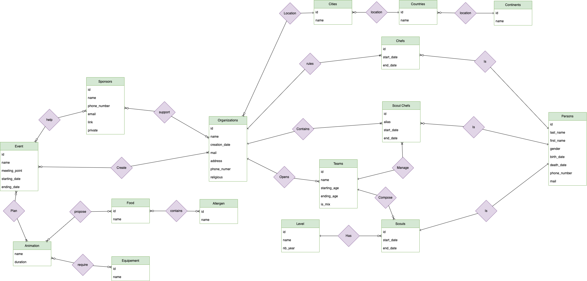

# Project - Scout Organizations Manager

## Situation

In order to help the organizers or/and to help the parents to choose “the best” for their kido the national Scouting organization ask for a database.

> Scouting is active in nearly every country engaging more than 57 million young people and volunteers worldwide. The World Organization of the Scout Movement is the largest international organisation for Scouting and recognises 172 National Scout Organizations as its members. https://www.scout.org/

## Determining entities, attributes, UIDs

+ A scout camp is an organization
+ An organization can be created and/or be closed
+ An organization can be contacted
+ Each organization has a chef
+ The chef can change through the time
+ The chef is a person
+ A person can be contacted (and has an urgency number) Each person has a date of birth and a date of death
+ Each organization is split in teams
+ A team have a limit age (start_age, end_age)
+ A team can be open and/or closed
+ Each team has a role play background (ex: Jungle Book, Cars)
+ Each team is manage by a scout chef
+ A team is open by an organization
+ A team is composed of scouts
+ Each scout has a level representing the number of year of experience
+ A scout is a person
+ A person can be a scout once (as a kid) but can be a scout chef or an organization chef several times
+ An organization can be sponsorized
+ A sponsor can be individual (not a company)
+ A sponsor can support one or multiple events and/or an organization An organization can create some event
+ An organization can associate to another to create an event
+ Each event have a meeting point and a duration
+ An event is composed of one or more animation
+ An animation might require some equipements
+ Some food can be offered during an animation
+ A food can contain allergen

## Entity-Relationship Diagram

